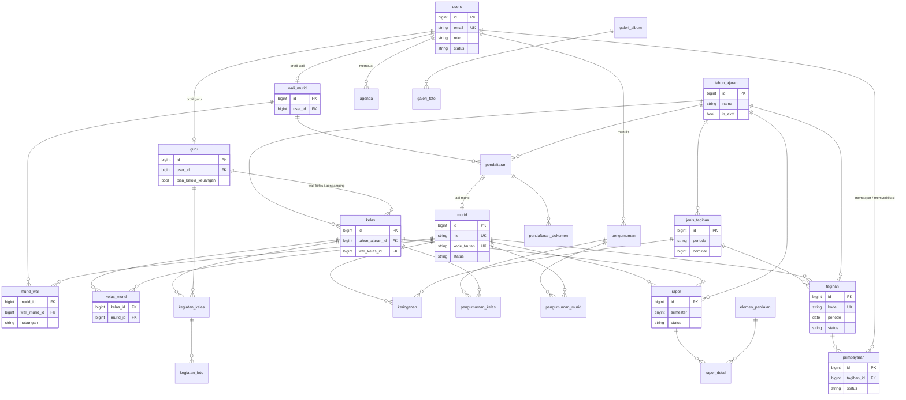
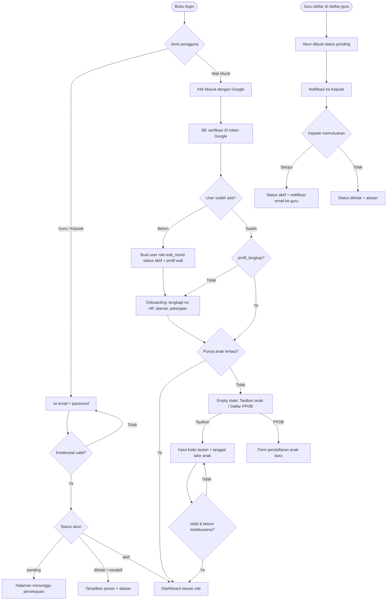
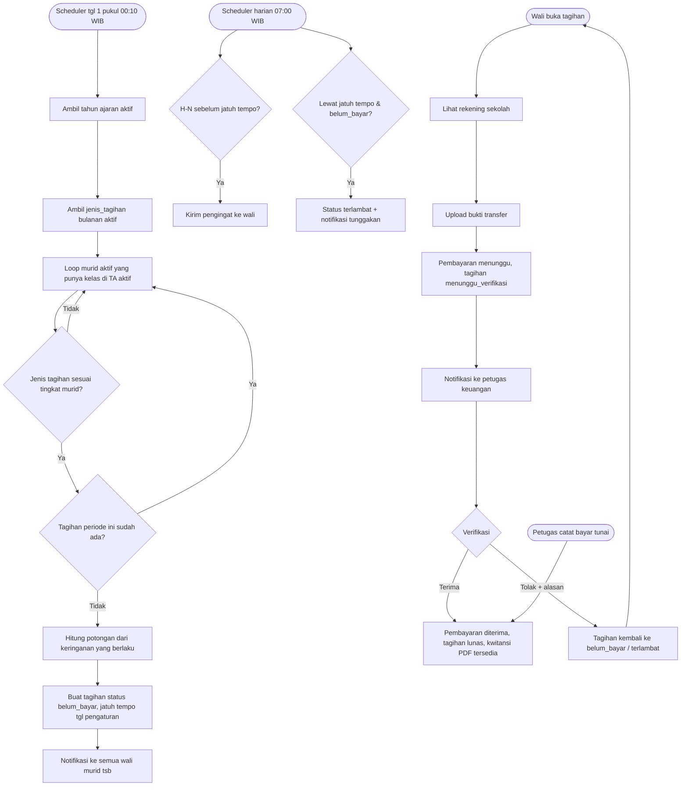
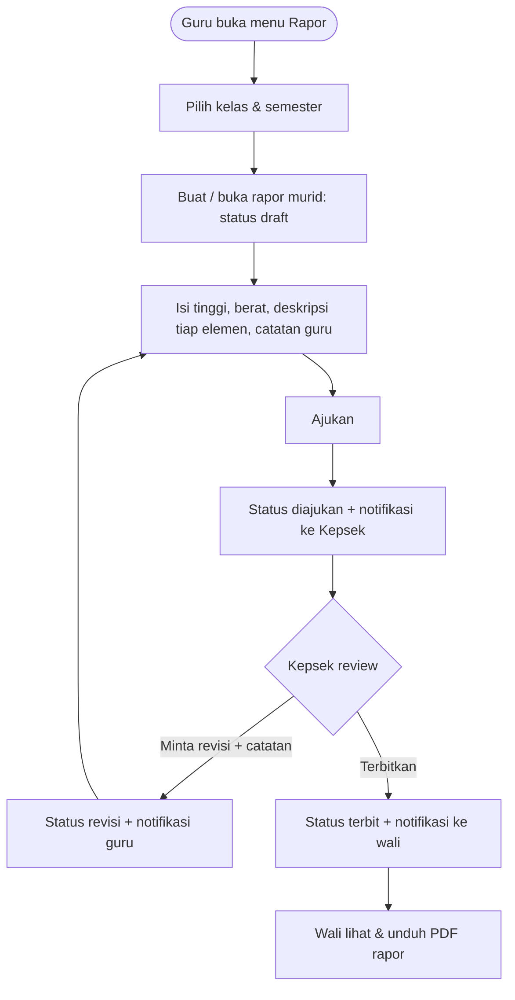
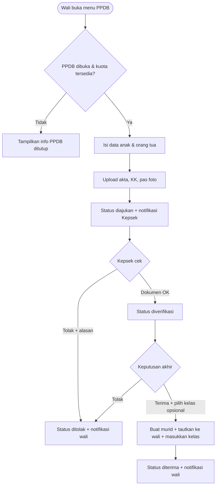

# PROMPT FRONTEND — Sistem Informasi TK Tarbiyathul Athfal 8

Kamu adalah senior frontend engineer (Next.js + TypeScript). Tugasmu membangun **website publik + dashboard** sistem informasi sekolah TK Tarbiyathul Athfal 8 di repo `FE_TK_Tarbiyathul_athfal_8`, dari nol, sesuai desain final di Bagian A. Backend Laravel ada di repo terpisah (`BE_TK_Tarbiyathul_athfal_8`) dan mengikuti kontrak API di A7 — **jangan mengarang endpoint atau field di luar A7**.

## Aturan kerja (WAJIB)

1. **Fase 0 dulu, tanpa menulis kode.** Baca seluruh prompt, cek versi Next.js/Tailwind/shadcn yang tersedia sekarang (perhatikan perubahan API antar versi, misal nama file middleware/proxy di Next.js terbaru), lalu tulis rencana (struktur folder, daftar route, komponen bersama, arah desain visual, risiko). Tampilkan rencana + pertanyaan (kalau ada), lalu **tunggu konfirmasiku**.
2. Kerjakan **per fase** (Bagian D). Di akhir tiap fase: jalankan `npm run lint`, `npm run typecheck` (`tsc --noEmit`), `npm run build`, `npm run check:slop`, pastikan bersih, review ulang kode & tampilan terhadap checklist Bagian C (anti AI-slop), update `dokumentasi.md`, lalu **berhenti dan laporkan**. Jangan lompat fase tanpa konfirmasi.
3. Tulis **file lengkap**, jangan potongan/diff parsial, jangan ada placeholder yang tidak jalan.
4. **TypeScript strict, DILARANG memakai tipe `any`** (termasuk `as any`, `any[]`, `Record<string, any>`). Pakai tipe dari kontrak, `unknown` + narrowing, atau generic. Aktifkan rule ESLint `@typescript-eslint/no-explicit-any: "error"`.
5. Kalau ada yang ambigu atau bertentangan dengan desain, **tanyakan**. Jangan mengubah alur/kontrak diam-diam.
6. Semua teks UI dalam **Bahasa Indonesia** yang ramah dan jelas untuk orang tua (hindari istilah teknis).

## `dokumentasi.md` (WAJIB)

Buat di root repo sejak Fase 1, dan selalu diperbarui. Isinya:
- Ringkasan proyek, stack + versi terpasang, cara install & menjalankan
- Daftar variabel `.env`
- **Changelog per fase**: setiap file baru dan file lama yang diubah, beserta alasan singkat
- Peta route + role yang boleh mengakses
- Keputusan teknis & desain yang diambil
- Status: fase selesai, sedang dikerjakan, dan yang tersisa; endpoint yang masih mock

Dokumen ini jadi acuan saat aku meminta prompt lanjutan, jadi harus akurat.
---

# BAGIAN A — DESAIN SISTEM (FINAL, JANGAN DIUBAH TANPA KONFIRMASI)

> Bagian ini sama persis di prompt FE dan BE. Ini acuan tunggal. Kalau kamu (agent) menemukan konflik atau hal yang tidak masuk akal, **tanyakan dulu**, jangan mengarang sendiri.

## A1. Ringkasan Sistem

Sistem Informasi Sekolah **TK Tarbiyathul Athfal 8** berbasis web (dan nanti mobile Flutter memakai API yang sama).

- **2 repo terpisah:**
  - `BE_TK_Tarbiyathul_athfal_8` → Laravel (REST API, token Sanctum, dokumentasi OpenAPI via Scramble)
  - `FE_TK_Tarbiyathul_athfal_8` → Next.js (App Router) + TypeScript + Tailwind CSS + shadcn/ui
- **3 role:**
  | Role (kode) | Siapa | Level |
  |---|---|---|
  | `super_admin` | Kepala Sekolah | Super Admin |
  | `guru` | Guru | Admin |
  | `wali_murid` | Orang tua / wali | User |
- **Murid TIDAK punya akun login.** Murid hanya data. Semua akses anak lewat akun wali murid (1 wali bisa punya beberapa anak, 1 anak bisa punya beberapa wali, misal ayah & ibu).
- **Tidak ada modul absensi.**
- Satu **dashboard bersama** (`/dashboard`) untuk semua role; menu, isi beranda, dan aksi menyesuaikan role.
- **Hanya super admin** yang bisa mengubah konten website publik (landing page, profil sekolah, galeri) dan pengaturan sistem.

## A2. Keputusan Desain Penting

1. **Login:**
   - Kepala Sekolah & Guru → email + password.
   - Wali Murid → Google Sign-In saja (daftar sendiri otomatis saat pertama login).
   - Akun Kepala Sekolah dibuat lewat seeder (hanya 1 akun `super_admin` aktif), sekaligus profil `guru` miliknya (jabatan "Kepala Sekolah") supaya Kepala Sekolah bisa mencatat kegiatan kelas, menjadi wali kelas bila perlu, dan tampil di daftar guru landing. Profil guru ini tidak muncul di `GET /guru`, tidak bisa dinonaktifkan, izin keuangannya tidak bisa diubah, dan tidak dihitung sebagai guru di statistik dashboard; profil ini tetap bisa dibuka dan diubah lewat `GET/PUT /guru/{id}`.
   - Guru bisa daftar sendiri → status `pending` → harus **disetujui Kepala Sekolah** baru bisa login. Kepala Sekolah juga bisa membuat akun guru langsung (status langsung `aktif`).
2. **Menautkan anak ke wali:** sekolah (super admin) generate **kode tautan** per murid (8 karakter, berlaku 14 hari). Wali memasukkan kode + tanggal lahir anak → langsung tertaut. Kode bisa dipakai lebih dari 1 wali (ayah & ibu) selama belum kedaluwarsa. Super admin bisa melepas tautan.
3. **PPDB online:** wali bisa mendaftarkan anak baru lewat dashboard saat PPDB dibuka. Pendaftaran selalu untuk tahun ajaran di pengaturan `ppdb.tahun_ajaran_id` (biasanya tahun ajaran berikutnya, bukan yang sedang aktif). PPDB tidak bisa dibuka (`ppdb.dibuka = true` ditolak) kalau `ppdb.tahun_ajaran_id` belum diisi atau tahun ajarannya tidak ada. Kalau diterima, sistem otomatis membuat data murid dan menautkannya ke wali tersebut.
4. **Tagihan (SPP) otomatis:** scheduler membuat tagihan bulanan tiap tanggal 1 untuk semua murid aktif, berdasarkan `jenis_tagihan` berperiode `bulanan` yang aktif di tahun ajaran aktif. Idempoten (tidak dobel, dijaga unique index). Potongan dari tabel `keringanan` otomatis diterapkan.
5. **Pembayaran:** transfer manual ke rekening sekolah + upload bukti oleh wali → diverifikasi. Pembayaran tunai dicatat langsung oleh petugas keuangan (otomatis diterima). **Tidak ada cicilan** (1 tagihan dibayar penuh). Payment gateway (Midtrans) = pengembangan nanti, bukan sekarang.
6. **Petugas keuangan:** super admin, ditambah guru yang diberi izin `bisa_kelola_keuangan = true` oleh super admin (untuk guru yang merangkap bendahara).
7. **Tunggakan:** tagihan lewat jatuh tempo otomatis berstatus `terlambat` dan wali dapat notifikasi. Super admin/guru juga bisa membuat pengumuman dengan target `murid` tertentu (misal yang menunggak).
8. **Rapor perkembangan anak (Kurikulum Merdeka PAUD):** penilaian naratif per elemen. Elemen bisa dikelola super admin (seed awal: Nilai Agama & Budi Pekerti; Jati Diri; Dasar-dasar Literasi, Matematika, Sains, Teknologi, Rekayasa & Seni). Alur: guru draft → ajukan → kepala sekolah terbitkan atau minta revisi → wali bisa lihat & unduh PDF.
9. **Privasi foto anak:** foto kegiatan kelas, bukti bayar, dokumen PPDB, dan foto rapor disimpan di disk **private**, diakses via endpoint terotorisasi / signed URL. Hanya galeri publik & aset landing yang di disk public.
10. **Uang** disimpan sebagai integer rupiah (tanpa desimal). **Zona waktu** `Asia/Jakarta`, bahasa `id`.
11. **Notifikasi** memakai Laravel database notifications (channel mail opsional). Push notification (FCM) nanti saat Flutter.

## A3. Use Case per Aktor

**Publik (tanpa login)**
- Melihat landing page (profil, visi-misi, program, fasilitas, guru, galeri, pengumuman publik, agenda publik, info PPDB, kontak)
- Melihat daftar & detail pengumuman publik, galeri
- Login (guru/kepsek), login Google (wali), daftar sebagai guru, lupa/reset password (guru/kepsek)

**Wali Murid (User)**
- Login Google, lengkapi profil (onboarding)
- Tautkan anak dengan kode tautan; lihat daftar anak; pindah anak aktif (switcher)
- Beranda: ringkasan tagihan, kegiatan kelas terbaru, pengumuman, agenda, rapor terbaru
- Lihat tagihan anak, bayar (upload bukti transfer), lihat riwayat pembayaran, unduh kwitansi
- Lihat kegiatan/dokumentasi kelas anak (foto)
- Lihat & unduh rapor yang sudah terbit
- Lihat pengumuman yang relevan (semua / wali / kelas anak / anaknya)
- Lihat agenda sekolah
- Daftar PPDB untuk anak baru & pantau statusnya
- Notifikasi, edit profil

**Guru (Admin)**
- Daftar akun (menunggu persetujuan), login email
- Beranda: kelas saya, jumlah murid, progres rapor, kegiatan terakhir, pengumuman
- Kelas saya: daftar murid kelas yang diampu (sebagai wali kelas / pendamping), detail murid & kontak wali
- Kelola kegiatan kelas (judul, tema, deskripsi, foto)
- Kelola rapor murid kelasnya (draft, isi per elemen, ajukan, perbaiki saat revisi)
- Buat pengumuman untuk kelasnya / murid di kelasnya
- Lihat status tagihan murid kelasnya (read-only)
- Lihat agenda
- **Jika `bisa_kelola_keuangan`**: akses menu keuangan seperti super admin (kecuali pengaturan rekening & jenis tagihan)
- Notifikasi, edit profil, ganti password

**Kepala Sekolah (Super Admin)**
- Semua yang bisa guru lakukan (lihat semua kelas)
- Beranda: statistik sekolah + daftar tindakan tertunda (guru pending, pembayaran menunggu verifikasi, rapor menunggu review, pendaftar PPDB baru)
- Kelola guru: tambah, edit, setujui/tolak pendaftaran, aktif/nonaktifkan, beri izin keuangan, tampilkan di landing
- Kelola tahun ajaran (aktifkan 1), kelas (wali kelas, pendamping, kapasitas), penempatan murid, kenaikan kelas massal
- Kelola murid (CRUD, status, generate kode tautan, lepas tautan wali), lihat wali murid
- Keuangan: jenis tagihan, keringanan, generate tagihan manual (idempoten), tagihan sekali bayar (uang pangkal/seragam), verifikasi pembayaran, catat tunai, batalkan tagihan, laporan & ekspor Excel, daftar tunggakan
- Rapor: review, terbitkan, minta revisi; kelola elemen penilaian
- Pengumuman (semua target) & agenda
- PPDB: buka/tutup, verifikasi, terima (pilih kelas), tolak
- **CMS website:** profil sekolah, konten landing, galeri
- Pengaturan: rekening sekolah, tanggal jatuh tempo, hari pengingat, info PPDB
- Log aktivitas

## A4. ERD



### Detail tabel

Semua tabel punya `id` (bigint PK) dan `created_at/updated_at` kecuali pivot yang disebut. Nama tabel bahasa Indonesia → set `$table` eksplisit di model.

- **users**: name, email (unique), password (nullable, wali Google tidak punya), google_id (nullable, unique), role (enum Role), status (enum StatusAkun), no_hp (nullable), avatar_path (nullable), email_verified_at, last_login_at, remember_token, deleted_at (soft delete)
- **guru**: user_id (FK unique), nip (nullable), nuptk (nullable), jenis_kelamin (L/P), tempat_lahir, tanggal_lahir, alamat, pendidikan_terakhir, jabatan (string, misal "Guru Kelas"), foto_path, bisa_kelola_keuangan (bool, default false), tampil_di_landing (bool, default false), disetujui_oleh (FK users, nullable), disetujui_at, alasan_penolakan (nullable)
- **wali_murid**: user_id (FK unique), nik (nullable), pekerjaan, alamat, profil_lengkap (bool, default false)
- **murid**: nis (unique, auto format `TA{tahun}{urut 4 digit}`), nisn (nullable unique), nik (nullable), nama_lengkap, nama_panggilan, jenis_kelamin, tempat_lahir, tanggal_lahir, agama, alamat, anak_ke (nullable), foto_path (nullable), catatan_khusus (nullable, misal alergi makanan / kebutuhan khusus — hanya terlihat guru & kepsek & wali anak itu), status (enum StatusMurid), tanggal_masuk, tanggal_keluar (nullable), kode_tautan (nullable unique), kode_tautan_expired_at (nullable), deleted_at
- **murid_wali** (pivot): murid_id, wali_murid_id, hubungan (enum Hubungan), is_kontak_utama (bool), created_at. Unique (murid_id, wali_murid_id)
- **tahun_ajaran**: nama ("2026/2027"), tanggal_mulai, tanggal_selesai, semester_aktif (1/2), is_aktif (hanya 1 yang true)
- **kelas**: tahun_ajaran_id, nama ("TK A1"), tingkat (enum Tingkat), wali_kelas_id (FK guru, nullable), guru_pendamping_id (FK guru, nullable), kapasitas (int, default 20)
- **kelas_murid**: kelas_id, murid_id, status (enum StatusKelasMurid, default aktif). Unique (kelas_id, murid_id). Aturan: 1 murid hanya boleh 1 kelas per tahun ajaran (validasi di service)
- **jenis_tagihan**: tahun_ajaran_id, nama ("SPP", "Uang Kegiatan", "Seragam"), deskripsi, nominal (unsigned bigint), periode (enum PeriodeTagihan), tingkat (nullable enum Tingkat; null = semua tingkat), is_aktif
- **keringanan**: murid_id, jenis_tagihan_id, tipe (enum TipeKeringanan), nilai (int; persen 1–100 atau rupiah), alasan, berlaku_mulai (date), berlaku_sampai (date nullable), dibuat_oleh (FK users)
- **tagihan**: kode (unique, `INV-YYYYMM-XXXXX`), murid_id, jenis_tagihan_id, tahun_ajaran_id, periode (date nullable, selalu tanggal 1 bulan tsb; null untuk tagihan sekali), nominal, potongan, total, jatuh_tempo (date), status (enum StatusTagihan), lunas_at (nullable), dibuat_oleh (FK users nullable; null = sistem), catatan. **Unique (murid_id, jenis_tagihan_id, periode)**
- **pembayaran**: kode (unique, `PAY-YYYYMMDD-XXXXX`), tagihan_id, dibayar_oleh (FK users nullable), metode (enum MetodeBayar), jumlah, tanggal_bayar, bukti_path (nullable, private), bank_pengirim (nullable), nama_pengirim (nullable), status (enum StatusPembayaran), alasan_penolakan (nullable), diverifikasi_oleh (FK users nullable), diverifikasi_at. 1 tagihan boleh punya banyak percobaan pembayaran, tapi maksimal 1 yang `menunggu` dan 1 yang `diterima`
- **pengumuman**: judul, slug (unique), isi (HTML, disanitasi), lampiran_path (nullable), target (enum TargetPengumuman), is_publik (bool, tampil di landing; hanya boleh jika target `semua`), is_pinned (bool), penulis_id (FK users), published_at (nullable = draft), deleted_at
- **pengumuman_kelas**: pengumuman_id, kelas_id. **pengumuman_murid**: pengumuman_id, murid_id
- **agenda**: judul, deskripsi, tanggal_mulai, tanggal_selesai, jenis (enum JenisAgenda), is_publik, dibuat_oleh
- **kegiatan_kelas**: kelas_id, guru_id, tanggal, tema, judul, deskripsi. **kegiatan_foto**: kegiatan_kelas_id, path (private), caption, urutan
- **elemen_penilaian**: kode, nama, deskripsi, urutan, is_aktif
- **rapor**: murid_id, kelas_id, tahun_ajaran_id, semester (1/2), tinggi_badan (decimal nullable, cm), berat_badan (decimal nullable, kg), catatan_guru, status (enum StatusRapor), catatan_revisi (nullable), dibuat_oleh (FK guru), diajukan_at, disetujui_oleh (FK users nullable), terbit_at. Unique (murid_id, tahun_ajaran_id, semester)
- **rapor_detail**: rapor_id, elemen_penilaian_id, deskripsi (text), foto_path (nullable, private). Unique (rapor_id, elemen_penilaian_id)
- **pendaftaran**: kode (unique, `PPDB-YYYY-XXXX`), wali_murid_id, hubungan (enum Hubungan; hubungan wali pendaftar dengan anak, dipakai saat menautkan ketika diterima), tahun_ajaran_id (diisi dari `ppdb.tahun_ajaran_id` saat mendaftar), tingkat_tujuan, nama_lengkap, nama_panggilan, jenis_kelamin, tempat_lahir, tanggal_lahir, nik, agama, alamat, nama_ayah, pekerjaan_ayah, nama_ibu, pekerjaan_ibu, no_hp, status (enum StatusPendaftaran), catatan (nullable), diproses_oleh (nullable), diproses_at, murid_id (nullable, terisi saat diterima)
- **pendaftaran_dokumen**: pendaftaran_id, jenis (enum JenisDokumen), path (private)
- **galeri_album**: judul, slug, deskripsi, cover_path, tanggal, is_publik. **galeri_foto**: galeri_album_id, path (public), caption, urutan
- **pengaturan**: kunci (unique), nilai (json), grup (string: profil | landing | keuangan | ppdb)
- Tabel bawaan: personal_access_tokens, notifications, password_reset_tokens, jobs, failed_jobs, activity_log (spatie)

### Kunci pengaturan (seed default)

| kunci | isi |
|---|---|
| `profil.nama_sekolah` | "TK Tarbiyathul Athfal 8" |
| `profil.npsn`, `profil.alamat`, `profil.telepon`, `profil.email`, `profil.maps_embed_url` | string |
| `profil.logo` | path gambar |
| `profil.visi` | string |
| `profil.misi` | string[] |
| `profil.sejarah`, `profil.sambutan_kepsek` | string (HTML) |
| `landing.hero` | { judul, subjudul, gambar, cta_teks } |
| `landing.program` | { judul, deskripsi, ikon }[] |
| `landing.fasilitas` | { nama, deskripsi, gambar }[] |
| `landing.keunggulan` | { judul, deskripsi, ikon }[] |
| `keuangan.rekening` | { bank, nomor, atas_nama }[] |
| `keuangan.tanggal_jatuh_tempo` | int (default 10) |
| `keuangan.hari_pengingat` | int (default 3, H-3 sebelum jatuh tempo) |
| `ppdb.dibuka` | bool |
| `ppdb.tanggal_buka`, `ppdb.tanggal_tutup` | date |
| `ppdb.tahun_ajaran_id` | int (id tahun ajaran tujuan PPDB; wajib terisi dengan tahun ajaran yang ada sebelum `ppdb.dibuka` bisa `true`) |
| `ppdb.kuota` | int |
| `ppdb.info` | string (HTML: syarat, biaya, alur) |

## A5. Enum (nilai string, dipakai sama di BE & FE)

- **Role**: `super_admin`, `guru`, `wali_murid`
- **StatusAkun**: `pending`, `aktif`, `ditolak`, `nonaktif`
- **StatusMurid**: `aktif`, `lulus`, `pindah`, `keluar`
- **Hubungan**: `ayah`, `ibu`, `wali`
- **Tingkat**: `A`, `B`
- **StatusKelasMurid**: `aktif`, `naik`, `tinggal`, `lulus`, `keluar`
- **PeriodeTagihan**: `bulanan`, `sekali`
- **TipeKeringanan**: `persen`, `nominal`
- **StatusTagihan**: `belum_bayar`, `menunggu_verifikasi`, `lunas`, `terlambat`, `dibatalkan`
- **MetodeBayar**: `transfer`, `tunai`
- **StatusPembayaran**: `menunggu`, `diterima`, `ditolak`
- **TargetPengumuman**: `semua`, `guru`, `wali_murid`, `kelas`, `murid`
- **JenisAgenda**: `kegiatan`, `libur`, `rapat`, `lainnya`
- **StatusRapor**: `draft`, `diajukan`, `revisi`, `terbit`
- **StatusPendaftaran**: `diajukan`, `diverifikasi`, `diterima`, `ditolak`
- **JenisDokumen**: `akta_kelahiran`, `kartu_keluarga`, `pas_foto`, `lainnya`

## A6. Flowchart

### Autentikasi & onboarding



### Tagihan bulanan & pembayaran



### Rapor



### PPDB



## A7. Kontrak API

**Base URL:** `{BE_URL}/api/v1`. Auth: header `Authorization: Bearer {token}` (Sanctum). Semua respons JSON.

**Format respons sukses:**
```json
{ "success": true, "message": "Berhasil", "data": {}, "meta": null }
```
**Respons list berpaginasi** (`?page=1&per_page=15`, default 15, max 100):
```json
{ "success": true, "message": "Berhasil", "data": [], "meta": { "current_page": 1, "per_page": 15, "total": 120, "last_page": 8 } }
```
**Respons error:**
```json
{ "success": false, "message": "Data tidak valid", "code": "VALIDATION_ERROR", "errors": { "email": ["Email wajib diisi."] } }
```
Kode error: `UNAUTHENTICATED` (401), `FORBIDDEN` (403), `ACCOUNT_PENDING` (403), `ACCOUNT_REJECTED` (403), `ACCOUNT_INACTIVE` (403), `NOT_FOUND` (404), `VALIDATION_ERROR` (422), `BUSINESS_RULE` (422, pelanggaran aturan bisnis), `TOO_MANY_REQUESTS` (429), `SERVER_ERROR` (500).

Untuk `ACCOUNT_REJECTED` saat login, alasan penolakan disertakan di `message` (contoh: `"Pendaftaran akun Anda ditolak. Alasan: …"`), tanpa field tambahan.

Status HTTP di luar daftar di atas dipetakan ke kode terdekat: 405 (metode HTTP salah) → 404 `NOT_FOUND`; 413 (unggahan melebihi batas server) → 422 `VALIDATION_ERROR` dengan pesan "Ukuran file terlalu besar. Maksimal 5 MB per file."; status 4xx lain → 422 `VALIDATION_ERROR`; 503 (pemeliharaan) → 503 `SERVER_ERROR`.

**Konvensi query list:** `?search=`, `?sort=nama` / `?sort=-created_at`, `?filter[status]=aktif`, `?filter[kelas_id]=3`. Tanggal format `YYYY-MM-DD`, datetime ISO 8601 dengan offset `+07:00`. Uang = integer rupiah.

**File private:** semua `*_url` untuk file private (foto kegiatan, foto murid, foto rapor, bukti bayar, dokumen PPDB) adalah signed URL `GET /media/{token}` yang **bisa langsung dipakai di `` / `<a>` tanpa header Authorization** dan berlaku **30 menit**. Setelah kedaluwarsa, ambil ulang datanya untuk mendapat URL baru. Hak akses dicek saat URL dibuat, jadi URL hanya dikirim ke pengguna yang berhak; siapa pun yang memegang URL bisa membukanya selama masa berlaku.

**Singkatan role:** SA = super_admin, G = guru, K = petugas keuangan (SA atau guru `bisa_kelola_keuangan`), W = wali_murid, Pub = publik.

**Scoping data otomatis:** endpoint yang sama mengembalikan data berbeda per role. G hanya melihat kelas yang dia ampu (wali kelas / pendamping) di TA aktif. W hanya melihat anaknya sendiri. SA melihat semua.

### Publik
- `GET /public/profil` — Pub — semua pengaturan grup profil + landing
- `GET /public/pengumuman` — Pub — pengumuman `is_publik` & terbit, berpaginasi
- `GET /public/pengumuman/{slug}` — Pub
- `GET /public/agenda?bulan=YYYY-MM` — Pub — agenda `is_publik`
- `GET /public/galeri` — Pub — album publik
- `GET /public/galeri/{slug}` — Pub — album + foto
- `GET /public/guru` — Pub — guru aktif `tampil_di_landing` (nama, jabatan, foto)
- `GET /public/ppdb` — Pub — status buka, tanggal, kuota, sisa kuota, info

### Auth
- `POST /auth/login` — Pub — `{ email, password, perangkat? }` → `{ token, user }`. Rate limit 5/menit per IP+email
- `POST /auth/google` — Pub — `{ id_token, perangkat? }` → `{ token, user, is_new }`
- `perangkat`: `web` | `mobile`, opsional, default `web`; dipakai sebagai nama token Sanctum.
- `POST /auth/register-guru` — Pub — `{ name, email, password, password_confirmation, no_hp, jenis_kelamin }` → 201, pesan menunggu persetujuan
- `POST /auth/forgot-password` — Pub — `{ email }` (hanya akun email+password)
- `POST /auth/reset-password` — Pub — `{ token, email, password, password_confirmation }`
- `GET /auth/me` — semua — user + profil (guru/wali) + untuk W: daftar anak ringkas
- `POST /auth/logout` — semua
- `PUT /auth/profil` — semua — multipart (avatar opsional)
- `PUT /auth/password` — SA, G

**Bentuk `user` di respons auth:**
```json
{
  "id": 1, "name": "…", "email": "…", "role": "guru", "status": "aktif",
  "no_hp": "…", "avatar_url": "…",
  "guru": { "id": 3, "bisa_kelola_keuangan": false, "kelas_diampu": [{ "id": 2, "nama": "TK A1" }] },
  "wali_murid": null,
  "permissions": { "kelola_keuangan": false }
}
```
Untuk W: `"wali_murid": { "id": 5, "profil_lengkap": true, "anak": [{ "id": 9, "nama_panggilan": "…", "kelas": "TK B2", "foto_url": "…" }] }`.

### Dashboard
- `GET /dashboard` — semua — payload sesuai role; W bisa kirim `?murid_id=`
  - SA: `{ statistik: { murid_aktif, guru_aktif, kelas, wali_murid }, keuangan_bulan_ini: { total_tagihan, terbayar, belum_terbayar, persen_lunas }, grafik_pemasukan: [{ bulan: "2026-01", total }] (12 bulan), tertunda: { guru_pending, pembayaran_menunggu, rapor_diajukan, pendaftaran_baru }, pengumuman_terbaru[], agenda_mendatang[] }`. `guru_aktif` tidak menghitung profil guru milik Kepala Sekolah.
  - G: `{ kelas_saya[] (id, nama, jumlah_murid), progres_rapor: { total, draft, diajukan, revisi, terbit }, kegiatan_terbaru[], pengumuman_terbaru[], agenda_mendatang[], keuangan_kelas: { lunas, belum }, pembayaran_menunggu }`. `pembayaran_menunggu` = jumlah pembayaran berstatus `menunggu` (int) untuk guru `bisa_kelola_keuangan`, `null` untuk guru lain.
  - W: `{ anak: {…}, tagihan_aktif[] , total_belum_bayar, kegiatan_terbaru[], pengumuman_terbaru[], agenda_mendatang[], rapor_terbaru }`

### Guru (manajemen)
- `GET /guru` — SA — filter status, search. Tidak termasuk profil guru milik Kepala Sekolah
- `GET /guru/{id}` — SA — termasuk profil guru milik Kepala Sekolah
- `POST /guru` — SA — buat akun guru langsung aktif → 201, data guru + `password_awal`. `password_awal` hanya muncul di respons ini, tidak dikirim lewat email, dan tidak disimpan sebagai teks biasa
- `PUT /guru/{id}` — SA — termasuk `bisa_kelola_keuangan`, `tampil_di_landing`. Untuk profil guru milik Kepala Sekolah, mengubah `bisa_kelola_keuangan` ditolak (422 `BUSINESS_RULE`)
- `POST /guru/{id}/setujui` — SA
- `POST /guru/{id}/tolak` — SA — `{ alasan }`
- `PATCH /guru/{id}/status` — SA — `{ status: aktif|nonaktif }` (nonaktif = cabut semua token). Ditolak untuk profil guru milik Kepala Sekolah (422 `BUSINESS_RULE`)

### Tahun ajaran & kelas
- `GET|POST /tahun-ajaran`, `PUT|DELETE /tahun-ajaran/{id}` — SA (GET: SA, G)
- `POST /tahun-ajaran/{id}/aktifkan` — SA — menonaktifkan yang lain
- `GET /kelas?filter[tahun_ajaran_id]=` — SA, G(scoped)
- `POST /kelas`, `PUT|DELETE /kelas/{id}` — SA
- `GET /kelas/{id}` — SA, G(scoped) — detail + murid
- `POST /kelas/{id}/murid` — SA — `{ murid_ids: [] }` (cek kapasitas & 1 kelas per TA)
- `DELETE /kelas/{id}/murid/{murid_id}` — SA
- `POST /kelas/kenaikan` — SA — `{ tahun_ajaran_tujuan_id, penempatan: [{ murid_id, kelas_tujuan_id | null, status: naik|tinggal|lulus }] }`

### Murid & wali
- `GET /murid` — SA, G(scoped), W(anak sendiri) — filter kelas_id, status, tingkat, search
- `GET /murid/{id}` — SA, G(scoped), W(anak sendiri) — detail + kelas aktif + wali
- `POST /murid`, `PUT /murid/{id}`, `DELETE /murid/{id}` — SA (multipart foto)
- `POST /murid/{id}/kode-tautan` — SA — generate baru → `{ kode, expired_at }`
- `DELETE /murid/{id}/wali/{wali_murid_id}` — SA — lepas tautan
- `GET /wali-murid` — SA — search, dengan jumlah anak
- `GET /wali-murid/{id}` — SA
- `PATCH /wali-murid/{id}/status` — SA — aktif / nonaktif
- `PUT /wali/profil` — W — onboarding `{ no_hp, alamat, pekerjaan, nik? }` → set `profil_lengkap`
- `POST /wali/tautkan-anak` — W — `{ kode, tanggal_lahir, hubungan }`. Rate limit 5/menit
- `GET /wali/anak` — W

### Keuangan
- `GET|POST /jenis-tagihan`, `PUT|DELETE /jenis-tagihan/{id}` — SA (GET: K)
- `GET|POST /keringanan`, `PUT|DELETE /keringanan/{id}` — K
- `GET /tagihan` — K, G(scoped, read-only), W(anak sendiri) — filter status, periode (YYYY-MM), kelas_id, murid_id, jenis_tagihan_id
- `GET /tagihan/{id}` — K, G(scoped), W(anak sendiri) — termasuk riwayat pembayaran + rekening sekolah
- `POST /tagihan` — K — tagihan sekali: `{ jenis_tagihan_id, murid_ids?: [], kelas_id?: , jatuh_tempo }` → `{ dibuat, dilewati }`. Murid yang sudah punya tagihan jenis itu (selain `dibatalkan`) dilewati
- `POST /tagihan/generate` — SA — `{ periode: "YYYY-MM" }` → `{ dibuat, dilewati }` (idempoten)
- `PATCH /tagihan/{id}/batalkan` — SA — `{ alasan }`
- `POST /tagihan/{id}/pembayaran` — W (multipart: bukti wajib, tanggal_bayar, bank_pengirim, nama_pengirim) / K (metode tunai → langsung diterima)
- `GET /pembayaran` — K, W(sendiri) — filter status, metode, tanggal
- `GET /pembayaran/{id}` — K, W(sendiri)
- `POST /pembayaran/{id}/terima` — K
- `POST /pembayaran/{id}/tolak` — K — `{ alasan }`
- `GET /pembayaran/{id}/bukti` — K, W(sendiri) — file (stream)
- `GET /pembayaran/{id}/kwitansi` — K, W(sendiri) — PDF (hanya status diterima)
- `GET /laporan/keuangan?dari=&sampai=&kelas_id=` — K — ringkasan + per jenis + per bulan
- `GET /laporan/keuangan/export?dari=&sampai=` — K — file .xlsx
- `GET /laporan/tunggakan?kelas_id=` — K — daftar murid menunggak + total

### Akademik & komunikasi
- `GET /kegiatan?filter[kelas_id]=` — SA, G(scoped), W(kelas anak)
- `GET /kegiatan/{id}` — sama
- `POST /kegiatan` — G(kelas sendiri), SA — multipart, `foto[]` maks 10
- `PUT|DELETE /kegiatan/{id}` — pembuat, SA
- `POST /kegiatan/{id}/foto`, `DELETE /kegiatan-foto/{id}` — pembuat, SA
- `GET /media/{token}` — tanpa token Bearer (signed URL) — stream file private untuk semua `*_url` private; hanya memvalidasi signature, masa berlaku 30 menit, dan token. Lihat "File private" di atas
- `GET /elemen-penilaian` — SA, G. `POST|PUT|DELETE` — SA
- `GET /rapor?filter[kelas_id]=&filter[semester]=&filter[status]=` — SA, G(scoped), W(anak, hanya terbit)
- `GET /rapor/{id}` — sama
- `POST /rapor` — G(scoped) — `{ murid_id, semester }` → buat draft dengan baris detail kosong per elemen aktif
- `PUT /rapor/{id}` — G(pembuat, hanya status draft/revisi) — `{ tinggi_badan, berat_badan, catatan_guru, detail: [{ elemen_penilaian_id, deskripsi }] }`
- `POST /rapor/{id}/detail/{detail_id}/foto` — G(pembuat)
- `POST /rapor/{id}/ajukan` — G
- `POST /rapor/{id}/terbitkan` — SA
- `POST /rapor/{id}/revisi` — SA — `{ catatan }`
- `GET /rapor/{id}/pdf` — SA, G(scoped), W(hanya terbit)
- `GET /pengumuman` — semua — feed relevan untuk user (SA: semua)
- `GET /pengumuman/{id}` — sama
- `POST /pengumuman` — SA (target apa pun), G (target `kelas` yang diampu / `murid` di kelasnya) — `{ judul, isi, target, kelas_ids?, murid_ids?, is_publik?, is_pinned?, publish: bool }`
- `PUT|DELETE /pengumuman/{id}` — penulis, SA
- `GET /agenda?bulan=YYYY-MM` — semua. `POST|PUT|DELETE` — SA
- `GET /notifikasi` — semua. `GET /notifikasi/belum-dibaca` → `{ jumlah }`. `POST /notifikasi/{id}/baca`. `POST /notifikasi/baca-semua`

**Bentuk notifikasi:** `{ id, jenis, judul, pesan, url (path FE tujuan, misal "/dashboard/tagihan/12"), dibaca_at, created_at }`. Jenis: `tagihan_baru`, `pengingat_tagihan`, `tagihan_terlambat`, `pembayaran_masuk`, `pembayaran_diterima`, `pembayaran_ditolak`, `guru_baru`, `rapor_diajukan`, `rapor_revisi`, `rapor_terbit`, `pengumuman_baru`, `pendaftaran_baru`, `pendaftaran_diproses`, `anak_tertaut`.

### PPDB
- `POST /pendaftaran` — W — multipart (data + `hubungan` + dokumen). Tahun ajaran diambil dari `ppdb.tahun_ajaran_id`. Tolak jika PPDB tutup / kuota penuh
- `GET /pendaftaran` — SA (semua), W (miliknya)
- `GET /pendaftaran/{id}` — SA, W(miliknya)
- `POST /pendaftaran/{id}/verifikasi` — SA
- `POST /pendaftaran/{id}/terima` — SA — `{ kelas_id? }`
- `POST /pendaftaran/{id}/tolak` — SA — `{ alasan }`

### CMS & pengaturan
- `GET /pengaturan?grup=` — SA (K boleh baca grup keuangan)
- `PUT /pengaturan` — SA — `{ items: { "profil.visi": "…", "landing.program": [ … ] } }` (validasi per kunci). `ppdb.dibuka = true` ditolak kalau `ppdb.tahun_ajaran_id` kosong atau tahun ajarannya tidak ada
- `POST /pengaturan/upload` — SA — gambar → `{ path, url }`
- Field gambar di pengaturan disimpan sebagai path. Di respons `GET /pengaturan` dan `GET /public/profil`, setiap field gambar mendapat pasangan `*_url`: kunci `profil.logo` disertai kunci `profil.logo_url`; `landing.hero` → `{ judul, subjudul, gambar, gambar_url, cta_teks }`; `landing.fasilitas[]` → `{ nama, deskripsi, gambar, gambar_url }`. Saat `PUT /pengaturan`, field `*_url` diabaikan.
- `GET|POST /galeri-album`, `PUT|DELETE /galeri-album/{id}` — SA
- `POST /galeri-album/{id}/foto` — SA — `foto[]`
- `PUT|DELETE /galeri-foto/{id}` — SA
- `GET /log-aktivitas` — SA — filter user, jenis, tanggal

---

# BAGIAN B — STANDAR TEKNIS FRONTEND

## B1. Stack & paket

Pakai **versi stabil terbaru** saat pengerjaan, cek kompatibilitas di Fase 0.

| Kebutuhan | Paket / pilihan |
|---|---|
| Framework | Next.js (App Router, terbaru) + React + TypeScript strict |
| Styling | Tailwind CSS + **shadcn/ui** (komponen di-copy ke repo, bisa dikustom) |
| Ikon | `lucide-react` |
| Data fetching & cache | `@tanstack/react-query` |
| Form & validasi | `react-hook-form` + `zod` + `@hookform/resolvers` |
| Tabel | `@tanstack/react-table` (via pola DataTable shadcn) |
| Grafik | Recharts (via komponen chart shadcn) |
| State filter di URL | `nuqs` (filter, search, page tersimpan di query string) |
| Tipe API | `openapi-typescript` + `openapi-fetch` dari `api.json` hasil Scramble BE |
| Login Google | `@react-oauth/google` (tombol Google Identity Services → dapat `credential`/ID token) |
| Rich text | Tiptap (StarterKit + Link + Underline) untuk pengumuman & konten CMS |
| Tanggal | `date-fns` + locale `id` |
| Toast | `sonner` |
| Upload | komponen dropzone sendiri (drag & drop + preview + kompres gambar di browser via `browser-image-compression`) |

## B2. Struktur folder

```
src/
  app/
    (public)/            # landing, pengumuman, galeri, ppdb
    (auth)/              # login, daftar-guru, lupa-password, reset-password, menunggu-persetujuan
    dashboard/           # layout dashboard + semua halaman role
    api/auth/            # route handler BFF: login, google, logout, me
    api/proxy/[...path]/ # route handler: teruskan request ke BE + Bearer dari cookie
  components/
    ui/                  # shadcn
    layout/              # Sidebar, Topbar, BottomNav, AnakSwitcher, NotifikasiBell
    shared/              # DataTable, PageHeader, EmptyState, StatusBadge, FileDropzone, RupiahText, ConfirmDialog, RichTextEditor, FilterBar
    features/<modul>/    # komponen per modul (tagihan, rapor, kegiatan, dst)
  lib/
    api/                 # client openapi-fetch, query keys, hooks per modul (useTagihanList, dst)
    auth/                # sesi, helper role & permission
    format.ts            # formatRupiah, formatTanggal, dll
    constants/           # label & warna tiap enum (A5)
  types/
    api.d.ts             # hasil generate openapi-typescript (jangan diedit manual)
    domain.ts            # tipe turunan/alias yang nyaman dipakai
  mocks/                 # data mock sesuai A7 (lihat B6)
```

## B3. Autentikasi (pola BFF, token tidak pernah disentuh JavaScript browser)

- `POST /api/auth/login` & `POST /api/auth/google` (route handler Next.js) memanggil BE `/auth/login` / `/auth/google`, lalu menyimpan token di cookie **httpOnly, secure (production), sameSite=lax**, nama `tk_token`, umur 30 hari. Simpan juga cookie non-httpOnly `tk_role` (hanya nilai role, untuk redirect cepat).
- `POST /api/auth/logout`: panggil BE `/auth/logout`, hapus kedua cookie.
- Semua request data dari browser lewat `/api/proxy/[...path]` yang menambahkan `Authorization: Bearer` dari cookie dan meneruskan method, query, body (termasuk multipart) dan **stream file** (PDF, bukti, export Excel) apa adanya. Respons 401 dari BE → hapus cookie, FE redirect ke `/login`.
- Server Component yang butuh data boleh fetch langsung ke BE dengan token dari `cookies()`.
- Route guard (middleware/proxy Next.js sesuai versi): `/dashboard/*` tanpa `tk_token` → `/login?next=...`. Sudah login buka `/login` → `/dashboard`. Pembatasan per role dicek juga di layout halaman (redirect ke `/dashboard` + toast "Kamu tidak punya akses"). **Otorisasi sebenarnya tetap di BE**; FE hanya menyembunyikan menu & mencegah salah arah.
- Penanganan kode error login: `ACCOUNT_PENDING` → `/menunggu-persetujuan`; `ACCOUNT_REJECTED` → tampilkan alasan; `ACCOUNT_INACTIVE` → pesan hubungi sekolah.
- Sesi user di React Query (`['me']` dari `GET /auth/me`), dengan hook `useSession()` → `{ user, role, isSuperAdmin, isGuru, isWali, bisaKelolaKeuangan }`.
- Wali: jika `profil_lengkap = false` → paksa ke `/dashboard/onboarding`. Jika belum punya anak → beranda menampilkan empty state "Tautkan anak" / "Daftar PPDB".
- **Anak aktif** (wali dengan >1 anak): `AnakSwitcher` di topbar, pilihan disimpan di cookie `tk_anak` dan dikirim sebagai `murid_id` ke endpoint terkait.

## B4. Peta route & akses

`SA` = super admin, `G` = guru, `K` = petugas keuangan (SA atau guru `bisa_kelola_keuangan`), `W` = wali murid.

**Publik:** `/`, `/pengumuman`, `/pengumuman/[slug]`, `/galeri`, `/galeri/[slug]`, `/ppdb`, `/login` (2 tab: "Orang Tua / Wali" → tombol Google; "Guru & Kepala Sekolah" → email+password), `/daftar-guru`, `/lupa-password`, `/reset-password`, `/menunggu-persetujuan`.

**Dashboard:**

| Route | SA | G | W | Isi |
|---|:-:|:-:|:-:|---|
| `/dashboard` | ✓ | ✓ | ✓ | Beranda sesuai role (B5) |
| `/dashboard/onboarding` | | | ✓ | Lengkapi profil wali |
| `/dashboard/anak` | | | ✓ | Kartu anak + form tautkan anak (kode + tanggal lahir + hubungan) |
| `/dashboard/kelas`, `/[id]` | ✓ | ✓ scoped | | Daftar kelas, detail + murid + penempatan (SA) |
| `/dashboard/murid`, `/[id]` | ✓ | ✓ scoped | | Tabel murid, detail (profil, kelas, wali, tagihan, rapor). SA: CRUD, generate kode tautan (tampil besar + tombol salin + bagikan ke WhatsApp `wa.me` + cetak kartu kode) |
| `/dashboard/guru`, `/[id]` | ✓ | | | Tab "Aktif" / "Menunggu Persetujuan" / "Nonaktif", approval, izin keuangan, tampil di landing |
| `/dashboard/wali-murid` | ✓ | | | Daftar wali + anak tertaut |
| `/dashboard/tahun-ajaran` | ✓ | | | CRUD + aktifkan + wizard kenaikan kelas |
| `/dashboard/tagihan`, `/[id]` | ✓ | ✓ read-only | ✓ | K: tabel semua tagihan + filter + buat tagihan sekali + generate manual. G: status kelasnya. W: kartu tagihan anak aktif, detail + rekening sekolah + form upload bukti |
| `/dashboard/pembayaran` | K | | ✓ | K: antrean verifikasi (preview bukti besar, terima/tolak dengan alasan) + catat tunai + riwayat. W: riwayat + unduh kwitansi |
| `/dashboard/keuangan/jenis-tagihan` | ✓ | | | CRUD |
| `/dashboard/keuangan/keringanan` | K | | | CRUD |
| `/dashboard/keuangan/laporan` | K | | | Filter rentang tanggal, ringkasan, grafik per bulan & per jenis, export Excel |
| `/dashboard/keuangan/tunggakan` | K | | | Daftar penunggak + tombol "Kirim pengumuman" (prefill target murid) |
| `/dashboard/kegiatan`, `/baru`, `/[id]` | ✓ | ✓ | ✓ lihat | Feed kegiatan (kartu foto), form dengan multi-upload, detail dengan galeri + lightbox |
| `/dashboard/rapor`, `/[id]` | ✓ | ✓ | ✓ terbit | G: pilih kelas & semester → daftar murid + status rapor → editor. SA: tab "Menunggu Review" → terbitkan / minta revisi. W: daftar rapor terbit + unduh PDF |
| `/dashboard/pengumuman`, `/baru`, `/[id]` | ✓ | ✓ | ✓ lihat | Feed; form Tiptap + pemilih target (kelas/murid, dibatasi untuk guru) + publik/pin/draft |
| `/dashboard/agenda` | ✓ kelola | ✓ | ✓ | Kalender bulanan + daftar; SA bisa tambah/edit |
| `/dashboard/ppdb`, `/[id]` | ✓ | | ✓ | W: form multi-step + status pendaftarannya. SA: tabel pendaftar, detail dokumen, verifikasi/terima (pilih kelas)/tolak |
| `/dashboard/website` | ✓ | | | **CMS landing page** (B7) |
| `/dashboard/website/galeri` | ✓ | | | Album & foto |
| `/dashboard/pengaturan` | ✓ | | | Tab: Rekening, Tagihan (jatuh tempo, pengingat), PPDB, Elemen Penilaian |
| `/dashboard/log-aktivitas` | ✓ | | | Tabel log + filter |
| `/dashboard/notifikasi` | ✓ | ✓ | ✓ | Semua notifikasi, tandai dibaca |
| `/dashboard/profil` | ✓ | ✓ | ✓ | Edit profil, avatar, ganti password (SA/G) |

Menu sidebar dibangun dari 1 konfigurasi (`lib/navigation.ts`) berisi `roles` dan `requiresKeuangan`, dikelompokkan: Utama, Akademik, Keuangan, Sekolah, Website & Pengaturan.

## B5. Beranda dashboard per role (dari `GET /dashboard`)

- **SA:** kartu statistik (murid aktif, guru aktif, kelas, wali), kartu keuangan bulan ini (tagihan, terbayar, belum, % lunas dengan progress), grafik pemasukan 12 bulan, **panel "Perlu Tindakan"** (guru menunggu persetujuan, pembayaran menunggu verifikasi, rapor menunggu review, pendaftar PPDB baru — masing-masing klik ke halaman terkait), pengumuman terbaru, agenda mendatang.
- **G:** sapaan + kelas yang diampu (kartu dengan jumlah murid), progres rapor (bar per status), kegiatan terakhir, pengumuman, agenda, ringkasan lunas/belum kelasnya. Jika guru `bisa_kelola_keuangan`, tampilkan juga kartu pembayaran menunggu verifikasi.
- **W:** kartu anak aktif (foto, nama panggilan, kelas), **kartu tagihan paling menonjol** (total belum dibayar + tombol "Bayar Sekarang"; merah jika terlambat), kegiatan kelas terbaru (foto), pengumuman, agenda, rapor terbaru.

## B6. Integrasi API & mode mock

- Client: `openapi-fetch` dengan `paths` dari `src/types/api.d.ts`, baseUrl `/api/proxy`. Script `npm run gen:api` = `openapi-typescript ${BE_REPO_PATH_OR_URL}/api.json -o src/types/api.d.ts`.
- **Sebelum `api.json` tersedia:** tulis tipe manual di `src/types/domain.ts` persis sesuai A7, dan aktifkan mode mock `NEXT_PUBLIC_USE_MOCK=true` (data contoh di `src/mocks/` dengan bentuk respons A7, termasuk pagination & error). Setiap hook API harus bisa jalan di mode mock dan mode asli **tanpa mengubah komponen**. Catat di `dokumentasi.md` endpoint mana yang masih mock. Setelah `api.json` ada, generate tipe dan sesuaikan `domain.ts` agar merujuk ke tipe hasil generate.
- Query key terpusat (`lib/api/query-keys.ts`), invalidasi yang benar setelah mutasi (misal terima pembayaran → invalidate tagihan, pembayaran, dashboard).
- Error handling terpusat: `VALIDATION_ERROR` → petakan `errors` ke field react-hook-form; error lain → toast `message`. 403/404 → halaman "Tidak ditemukan / tidak punya akses" yang ramah.
- Badge notifikasi: polling `GET /notifikasi/belum-dibaca` tiap 60 detik (hanya saat tab aktif).
- File private: tampilkan dari `*_url` yang dikirim BE (sudah signed). Unduhan PDF/Excel lewat `/api/proxy/...` dengan nama file yang rapi.

## B7. CMS landing page (hanya Super Admin)

Halaman `/dashboard/website` dengan tab:
1. **Profil Sekolah** — nama, NPSN, alamat, telepon, email, embed Google Maps, logo (upload), visi, misi (list dinamis tambah/hapus/urutkan), sejarah & sambutan kepala sekolah (Tiptap).
2. **Hero** — judul, subjudul, gambar, teks tombol CTA.
3. **Program** — list dinamis `{ judul, deskripsi, ikon }` (ikon dipilih dari daftar ikon lucide yang disediakan).
4. **Keunggulan** — list dinamis sama seperti program.
5. **Fasilitas** — list dinamis `{ nama, deskripsi, gambar }`.

Simpan per tab lewat `PUT /pengaturan`, upload gambar lewat `POST /pengaturan/upload`. Sediakan tombol **"Lihat Pratinjau"** (buka landing di tab baru) dan indikator perubahan belum disimpan (konfirmasi sebelum pindah tab/halaman). Landing page `/` membaca semua ini dari `GET /public/profil`, dengan ISR/revalidate 5 menit + `revalidateTag` setelah SA menyimpan (lewat route handler).

Landing page berisi: navbar, hero, sambutan kepala sekolah, visi-misi, program, keunggulan, fasilitas, guru (`/public/guru`), galeri terbaru, pengumuman publik terbaru, agenda publik, banner PPDB (jika dibuka), kontak + peta, footer.

## B8. Desain visual

- **Identitas hijau dominan** sesuai branding sekolah (tanyakan kode warna logo di Fase 0; jika belum ada, usulkan palet hijau dengan aksen kuning hangat yang cocok untuk TK). Definisikan sebagai CSS variable/token Tailwind, jangan hardcode warna di komponen.
- Nuansa **ceria tapi rapi dan terpercaya** (sekolah anak, tapi juga mengurus uang orang tua). Sudut membulat, ilustrasi/aksen bentuk sederhana boleh di landing; dashboard tetap bersih.
- Font ramah dan mudah dibaca (usulkan pasangan font di Fase 0, via `next/font`).
- Hindari tampilan template generik: landing harus terasa milik TK ini (pakai nama, foto, konten dari CMS).
- **Mobile-first**, terutama untuk wali (mayoritas akses dari HP): dashboard wali memakai **bottom navigation** di mobile (Beranda, Tagihan, Kegiatan, Pengumuman, Lainnya) dan sidebar di desktop. SA/G: sidebar yang bisa diciutkan + sheet di mobile. Tabel di mobile berubah jadi kartu.
- Warna status konsisten dari `lib/constants` (contoh: lunas = hijau, menunggu = kuning, terlambat = merah, dibatalkan = abu).
- Setiap halaman wajib punya state **loading (skeleton), kosong (empty state dengan ajakan tindakan), dan error**.
- Aksesibilitas: kontras cukup, label form, fokus terlihat, navigasi keyboard, `alt` gambar.
- Format: rupiah `Rp 150.000`, tanggal `26 September 2026`, relatif untuk notifikasi ("3 jam lalu").
- Light mode saja untuk sekarang.

---

# BAGIAN C — ANTI AI-SLOP (WAJIB, DICEK TIAP AKHIR FASE)

"AI-slop" = hasil yang kelihatan jelas dibuat AI tanpa dipikir: generik, berlebihan, penuh basa-basi, atau mengarang. Proyek ini harus terlihat dan terbaca seperti dikerjakan developer yang paham konteks TK ini. Aturan di bawah bersifat **larangan konkret**, bukan saran.

## C1. Kode (berlaku untuk semua file)

- **Komentar hanya untuk "kenapa"**, bukan "apa". Dilarang komentar yang mengulang kode (`// ambil data murid` di atas `$murid = Murid::find()`), komentar banner/pembatas (`// ===== SECTION =====`), dan komentar penjelasan tutorial.
- **Dilarang** kode mati, kode yang di-comment, import tidak terpakai, `console.log` / `dd()` / `dump()` / `var_dump` tertinggal, `TODO` tanpa tiket/alasan.
- **Dilarang emoji** di kode, log, pesan commit, nama file, dan pesan error.
- **Jangan over-engineering (YAGNI):** tidak ada Repository pattern di atas Eloquent, tidak ada interface dengan satu implementasi, tidak ada `BaseService`/`BaseController` generik, tidak ada factory/strategy untuk satu kasus, tidak ada komponen wrapper yang cuma meneruskan props. Abstraksi baru boleh dibuat kalau pola yang sama sudah muncul **3 kali**.
- **Jangan menambah fitur, config, atau paket di luar desain** (dark mode, i18n multi-bahasa, feature flag, analytics, PWA, websocket, dsb). Kalau menurutmu perlu, usulkan dulu.
- **Jangan menelan error:** tidak ada `try/catch` kosong, tidak ada `catch` yang mengembalikan sukses palsu atau pesan generik tanpa log.
- **Jangan mengarang API/paket.** Sebelum memakai method atau opsi sebuah library, pastikan ada di versi yang terpasang (baca dokumentasi / source di `vendor` / `node_modules`). Kalau ragu, bilang.
- **Tidak ada data hardcode di komponen/controller** kalau datanya ada di API/database/pengaturan. Angka ajaib pindahkan ke konstanta/config dengan nama yang jelas.
- **Penamaan jelas dan konsisten dengan glosarium (C4).** Dilarang `data2`, `temp`, `handleClick2`, `newFunction`, `res`, `obj`, file keranjang sampah (`utils.ts` / `Helper.php` berisi puluhan fungsi campur aduk) — kelompokkan per domain.
- **Ukuran wajar:** komponen React > ±250 baris atau method > ±40 baris dipecah berdasarkan tanggung jawab, bukan dipotong asal.
- **Jangan membungkam checker:** dilarang `@ts-ignore`, `@ts-expect-error`, `eslint-disable`, `@phpstan-ignore`, non-null assertion `!` kecuali ada komentar alasan yang masuk akal.
- **Konsisten:** satu cara untuk satu hal (satu pola fetch data, satu pola form, satu pola response). Jangan campur gaya di file berbeda.

## C2. Test

- Test menguji **perilaku** (input → output/efek), bukan detail implementasi.
- Dilarang test kosong, `assertTrue(true)`, test yang me-mock hal yang sedang diuji, atau snapshot massal tanpa makna.
- Nama test menjelaskan skenario dalam kalimat (`wali tidak bisa melihat tagihan anak orang lain`).
- Test harus benar-benar dijalankan. Jangan melaporkan "semua test lulus" tanpa menjalankannya.

## C3. Teks UI, konten, dan pesan

- **Bahasa Indonesia yang wajar, spesifik, dan singkat.** Tulis seperti staf TU yang ramah, bukan brosur marketing.
- **Kata/frasa terlarang:** "seamless", "revolusioner", "solusi terdepan/terbaik", "era digital", "transformasi digital", "memberdayakan", "tingkatkan pengalaman Anda", "platform all-in-one", "mudah, cepat, dan aman", "#1", "canggih", "inovatif", "Selamat datang di masa depan…", "Mari bersama…". Juga hindari pola tiga kata sifat berjejer.
- **Dilarang emoji dan tanda seru berlebihan** di UI. Maksimal satu tanda seru untuk pesan sukses yang memang perlu.
- **Label tombol = kata kerja yang spesifik:** "Unggah Bukti Transfer", "Setujui Guru", "Terbitkan Rapor" — bukan "Submit", "Kirim Sekarang!", "Lanjutkan" di mana-mana.
- **Pesan error** menjelaskan apa yang terjadi + apa yang bisa dilakukan ("Kode tautan sudah kedaluwarsa. Minta kode baru ke pihak sekolah."), bukan "Terjadi kesalahan".
- **Empty state** memberi arah tindakan yang nyata ("Belum ada tagihan bulan ini."), bukan kalimat puitis.
- **Dilarang data palsu yang tampil ke publik:** tidak ada statistik karangan ("1000+ siswa bahagia"), testimoni fiktif, rating bintang, atau logo mitra palsu. Semua konten landing berasal dari CMS / API.
- **Data seed/mock realistis Indonesia:** nama anak & orang tua Indonesia yang wajar, alamat Semarang, nomor HP format `08xx`. Dilarang "John Doe", "Test User", "Lorem ipsum", "asdf".

## C4. Glosarium istilah (pakai persis, di kode dan UI)

| Istilah | Jangan diganti dengan |
|---|---|
| Kepala Sekolah | Admin utama, Principal, Kepsek (di UI) |
| Guru | Pengajar, Staff, Teacher |
| Wali Murid | Parent, User (di UI). "Orang Tua / Wali" hanya di tab login |
| Murid | Siswa, Peserta didik, Student (pilih satu: **Murid**) |
| Tagihan | Invoice, Bill |
| Pembayaran | Transaksi, Payment |
| Kegiatan Kelas | Aktivitas, Jurnal, Post |
| Rapor | Laporan perkembangan, Report card |
| Pengumuman | Info, Berita, Broadcast |
| Kode Tautan | Kode undangan, Token, Invite code |
| Tahun Ajaran | Periode, Academic year |

## C5. Dokumentasi, commit, dan laporan fase

- `dokumentasi.md` & README **faktual dan padat**: tanpa kalimat pembuka basa-basi, tanpa emoji di heading ("🚀 Fitur Utama"), tanpa mengklaim fitur yang belum dibuat. Tulis yang benar-benar ada dan cara menjalankannya.
- **Commit** kecil per fitur, format Conventional Commits (`feat(tagihan): generate tagihan bulanan otomatis`), jelaskan apa & kenapa. Dilarang "update files", "fix", "wip", atau commit raksasa satu fase sekaligus.
- **Laporan akhir fase jujur:** sebutkan apa yang sudah diuji dan bagaimana, apa yang gagal, apa yang belum terverifikasi, dan asumsi yang kamu ambil. Dilarang "semua berjalan sempurna" / "production-ready" tanpa bukti.

## C6. Cek otomatis sebelum lapor fase

Jalankan pencarian ini dan bersihkan hasilnya (atau jelaskan kenapa sah):
- Emoji di source: cari karakter emoji di folder source.
- Sisa debug: `console.log`, `debugger`, `dd(`, `dump(`, `var_dump`, `ray(`.
- Placeholder: `TODO`, `FIXME`, `lorem`, `ipsum`, `John Doe`, `example.com` (kecuali di test).
- Pembungkam checker: `@ts-ignore`, `eslint-disable`, `@phpstan-ignore`, `as any`, `: any`.
- Kata terlarang C3 di file UI/konten/seed.

Buat perintah ini sebagai script (`npm run check:slop` di FE / `composer check:slop` di BE) supaya bisa dijalankan ulang.

## C7. Desain visual (khusus frontend)

Desain harus terasa **milik TK Tarbiyathul Athfal 8**, bukan template SaaS yang diganti logonya.

**Dilarang:**
- Gradien ungu/biru/indigo, teks bergradien, efek glow, blob blur di background, glassmorphism.
- Tampilan shadcn default tanpa kustomisasi. Token warna, radius, font, dan bayangan wajib disesuaikan dengan identitas sekolah.
- Pola "3 kartu fitur dengan ikon di lingkaran" diulang di setiap section landing. Tiap section punya komposisi sesuai isinya (sambutan = foto + teks, fasilitas = grid foto, agenda = daftar tanggal, dst).
- Setiap kartu `rounded-2xl shadow-xl border` + hover scale. Pakai elevasi seperlunya dan konsisten (maksimal 2 tingkat bayangan).
- Ikon di setiap judul, tombol, dan item list. Ikon hanya jika membantu mengenali/memindai. Satu set ikon (lucide), satu ukuran stroke.
- Emoji sebagai ikon atau dekorasi.
- Kartu KPI dengan panah tren palsu ("+12% dari bulan lalu") kalau datanya tidak ada di API. Grafik hanya kalau ada data runtun waktu/perbandingan, bukan untuk satu angka.
- Animasi di semua elemen (fade-up tiap section, bounce, parallax). Animasi hanya untuk umpan balik & transisi, durasi 150–250ms, dan hormati `prefers-reduced-motion`.
- Semua konten rata tengah. Gunakan perataan kiri untuk teks bacaan dan grid yang jelas.
- Ilustrasi/foto stok bergaya AI (anak-anak "sempurna" hasil generate). Pakai foto dari CMS; kalau belum ada, placeholder netral (blok warna + label) yang jelas harus diganti.
- Ukuran font acak. Tentukan skala tipografi (maksimal ±6 ukuran) dan skala spasi (kelipatan 4px) di token, lalu pakai konsisten.

**Wajib:**
- Di **Fase 0**, tampilkan **2 arah desain** berbeda (palet dengan kode warna, pasangan font, radius, contoh wireframe teks/ASCII untuk landing dan beranda dashboard wali di HP) beserta alasannya. Aku pilih satu.
- Setelah **landing page selesai (Fase 2)** dan setelah **beranda wali selesai (Fase 3)**, berhenti untuk review desain sebelum lanjut ke halaman lain.
- Hierarki jelas per halaman: satu hal paling penting (misal kartu tagihan di beranda wali), sisanya mendukung.
- Kepadatan informasi sesuai pengguna: dashboard SA/guru boleh padat (tabel), dashboard wali lega dan besar untuk jempol (target sentuh min 44px).
- Gunakan komponen yang sama untuk hal yang sama (satu `StatusBadge`, satu `PageHeader`, satu `EmptyState`) supaya tampilan konsisten.

---

# BAGIAN D — FASE PENGERJAAN

| Fase | Isi | Selesai jika |
|---|---|---|
| **0. Analisis** | Baca semua, cek versi, rencana folder & route, arah desain (palet, font, contoh layout), daftar pertanyaan. **Tanpa kode.** | Rencana disetujui |
| **1. Fondasi** | Setup Next.js + TS strict + ESLint (no-any) + Tailwind + shadcn, design token & font, `lib/format`, konstanta enum, tipe domain dari A7, client API + mode mock, BFF auth + proxy + route guard, React Query provider, `dokumentasi.md` | Build bersih, login mock bisa masuk dashboard kosong |
| **2. Publik & auth** | Landing lengkap (data `/public/*`), pengumuman, galeri, info PPDB, login 2 tab (Google + email), daftar guru, lupa/reset password, menunggu persetujuan | Semua halaman publik responsif, alur login semua role (mock) |
| **3. Shell dashboard** | Layout (sidebar, topbar, bottom nav wali), menu per role, notifikasi bell + halaman, AnakSwitcher, onboarding wali, halaman anak + tautkan, beranda 3 role, profil | Tiap role melihat menu & beranda yang benar |
| **4. Master data** | Guru (+approval), tahun ajaran (+wizard kenaikan), kelas (+penempatan), murid (+kode tautan & bagikan), wali murid | CRUD lengkap dengan validasi & state |
| **5. Keuangan** | Tagihan (W bayar + upload bukti, K kelola, G read-only), pembayaran (antrean verifikasi, catat tunai, riwayat, kwitansi), jenis tagihan, keringanan, generate, laporan + grafik + export, tunggakan | Alur bayar → verifikasi → lunas jalan end-to-end |
| **6. Akademik & komunikasi** | Kegiatan (feed, multi-upload, lightbox), rapor (editor per elemen, ajukan, review SA, PDF), pengumuman (Tiptap + target), agenda (kalender) | Alur rapor & pengumuman per role benar |
| **7. PPDB, CMS, pengaturan** | PPDB (form multi-step W, review SA), CMS website 5 tab + pratinjau + revalidate, galeri, pengaturan, log aktivitas | SA ubah konten → landing ikut berubah |
| **8. Integrasi & polish** | Generate tipe dari `api.json`, matikan mock per modul & uji ke BE asli, rapikan empty/loading/error, cek responsif & aksesibilitas, `dokumentasi.md` & README final | Tidak ada endpoint mock tersisa, lint/typecheck/build bersih |

Catatan: kalau BE sudah selesai dan `api.json` tersedia sebelum kamu mulai, lewati mode mock dan langsung pakai tipe hasil generate sejak Fase 1.

Mulai dari **Fase 0** sekarang.
